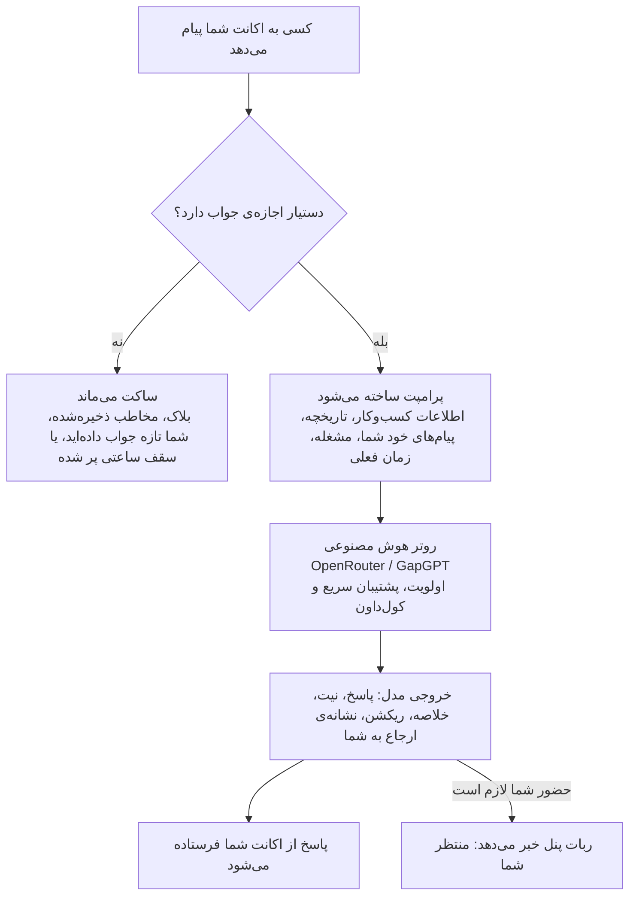

<div align="center">

# 🤖 Telegram DM Assistant

**دستیار هوش مصنوعی که وقتی سرتان شلوغ است یا آفلاین هستید، به پیام‌های پیوی اکانت تلگرام خودتان جواب می‌دهد<br>و همین که خودتان وارد گفتگو شوید، کنار می‌رود.**


[English](README.md) · **فارسی**

</div>

---

<div dir="rtl">

## چرا این پروژه؟

اگر از طریق تلگرام خدمات می‌فروشید، هر پیامِ بی‌جواب یعنی مشتری‌ای که شاید سراغ نفر بعدی برود.
ولی نمی‌شود تمام روز آنلاین بود: سر پروژه هستید، خوابید، یا اصلاً در دسترس نیستید.

این پروژه یک دستیار را **داخل اکانت خودتان** می‌گذارد. مردم مثل همیشه به *خود شما* پیام می‌دهند و در چند ثانیه
جواب به‌دردبخور می‌گیرند؛ نه یک پیام خودکارِ «به‌زودی پاسخ می‌دهیم» و نه یک ربات پشتیبانی جدا که باید دنبالش بگردند.

| بدون دستیار | با دستیار |
|---|---|
| پیامِ ساعت ۲ بامداد تا صبح بی‌جواب می‌ماند | در چند ثانیه و به زبان خودِ مشتری جواب می‌گیرد |
| برمی‌گردید و با ۴۰ پیامِ نخوانده روبه‌رو می‌شوید | یک خلاصه‌ی سه‌جمله‌ای و نیت مشتری را می‌خوانید |
| هر روز همان سؤال‌های قیمت و زمان تحویل را جواب می‌دهید | دستیار از روی متنی که یک بار نوشته‌اید جواب می‌دهد |
| نگرانید ربات از طرف شما قول اشتباه بدهد | طوری ساخته شده که فقط بازه‌ی حدودی بگوید؛ نه قیمت نهایی، نه تاریخ قطعی |
| مشتریِ جدی بین گفتگوهای معمولی گم می‌شود | گفتگو در پنل با علامت **🔔 منتظر شما** مشخص می‌شود |

قرار نیست جای شما را بگیرد. گفتگو را زنده نگه می‌دارد و جزئیات را جمع می‌کند تا وقتی برگشتید، به‌جای شروع از
«سلام، بفرمایید» مستقیم سراغ بستن کار بروید.

## امکانات

**پاسخ‌گویی**
- فقط در پیوی، از اکانت خودتان و به همان زبانی که طرف نوشته جواب می‌دهد
- پیام‌های پشت‌سرهم را یک‌جا می‌خواند و یک پاسخ منسجم می‌فرستد
- ۵۰ پیام آخر هر نفر را به‌همراه خلاصه‌ی گفتگو و نیت او به خاطر دارد
- مثل یک آدم واقعی روی پیام‌ها ریکشن می‌زند (👍 🙏 🔥 …)، فقط وقتی حداقل ۸۰٪ مطمئن است که به‌جاست

**امن برای کسب‌وکار شما**
- درباره‌ی خدمات و قیمت **فقط** از روی متن «درباره کسب‌وکار» که خودتان نوشته‌اید جواب می‌دهد
- قیمت همیشه بازه‌ی حدودی است؛ قیمت نهایی، تخفیف، قرارداد و پرداخت با خود شماست
- صادق است: خودش را دستیار شما معرفی می‌کند و هیچ‌وقت وانمود نمی‌کند خودِ شما یا انسان است
- نمی‌گوید چه مدل هوش مصنوعی‌ای پشتش است و به اسپم و پیام‌های بی‌معنی جواب نمی‌دهد

**همکار شما، نه جایگزین شما**
- وقتی خودتان دستی جواب بدهید، دستیار در همان گفتگو ساکت می‌شود (پیش‌فرض: ۲ ساعت)
- حرفی که خودتان زده‌اید (قیمت، تاریخ، قول) مرجع جواب‌های بعدی دستیار می‌شود
- هر جا حضور خودتان لازم باشد، گفتگو را به شما می‌سپارد و در پنل خبر می‌دهد
- بخش اختیاری «مشغله»: بنویسید تا چه تاریخی مشغول هستید تا اگر کسی پرسید، صادقانه همین را بگوید

**مسیریابی مطمئن بین مدل‌ها**
- دو ارائه‌دهنده‌ی سازگار با OpenAI از پیش آماده: **OpenRouter** و **GapGPT**
- هر تعداد مدل برای هر ارائه‌دهنده، به ترتیب اولویتی که خودتان می‌چینید
- سه استراتژی: اولویت‌دار با پشتیبان سریع، مسابقه‌ی همزمان، یا نوبتی
- مدلِ خراب خودکار برای مدتی کنار گذاشته می‌شود؛ تست سلامت با یک دکمه؛ آمار ۲۴ ساعت اخیر

**پنل مدیریت داخل تلگرام**
- همه‌چیز از یک ربات پنل خصوصی با دکمه‌های شیشه‌ای مدیریت می‌شود؛ نیازی به ویرایش فایل نیست
- کلید API و مدل‌ها بعد از راه‌اندازی، از داخل همان پنل اضافه می‌شوند
- رابط فارسی و انگلیسی (تاریخ شمسی یا میلادی) و هر منطقه‌ی زمانی

## چطور کار می‌کند؟

</div>



<div dir="rtl">

دو اتصال تلگرام کنار هم در یک برنامه اجرا می‌شوند:

| بخش | چیست | چه می‌کند |
|---|---|---|
| **یوزربات** | اکانت خود شما، از طریق API رسمی تلگرام (Telethon) | پیام‌های پیوی را می‌خواند و جواب‌ها را می‌فرستد |
| **ربات پنل** | یک ربات معمولی که در ‎@BotFather‎ می‌سازید | پنل مدیریت خصوصی شما؛ فقط خودتان به آن دسترسی دارید |

## شروع سریع

### ۱. چه چیزهایی لازم است؟

| مورد | از کجا |
|---|---|
| پایتون ۳٫۹ یا جدیدتر | [python.org](https://www.python.org/downloads/) |
| ‏`API_ID` و `API_HASH` | [my.telegram.org](https://my.telegram.org) ← بخش *API development tools* |
| توکن ربات برای پنل | [‎@BotFather‎](https://t.me/BotFather) ← دستور ‎`/newbot`‎ (یک ربات جدید فقط برای همین کار) |
| کلید API هوش مصنوعی | [OpenRouter](https://openrouter.ai/keys) یا GapGPT — یکی از این دو کافی است |

### ۲. نصب

<div dir="ltr">

```bash
git clone https://github.com/Anfildboy/telegram-dm-assistant.git
cd telegram-dm-assistant
python3 -m venv venv
./venv/bin/pip install -r requirements.txt
```

</div>

### ۳. اولین اجرا

<div dir="ltr">

```bash
./venv/bin/python assistant_bot.py
```

</div>

اولین اجرا تعاملی است: سه مقدارِ لازم را می‌پرسد و در فایل `.env` کنار برنامه ذخیره می‌کند:

<div dir="ltr">

```text
Telegram DM Assistant — راه‌اندازی اولیه | first-run setup
مقدارها در .env ذخیره می‌شوند | values are saved to .env

  API_ID    ← my.telegram.org : ********
  API_HASH  ← my.telegram.org : ********
  Bot token ← @BotFather : ********

✓ ذخیره شد | saved → .env
```

</div>

بعد تلگرام شماره‌ی موبایل، کد ورود و (اگر فعال باشد) رمز دومرحله‌ای را می‌پرسد.
وقتی در لاگ خط `Running as <نام شما> … panel: @your_bot → /start` را دیدید، برنامه در حال کار است.

### ۴. تکمیل تنظیمات در پنل

ربات پنل را در تلگرام باز کنید و `/start` بزنید.

۱. **زبان را انتخاب کنید** — فارسی یا انگلیسی.

۲. **🧠 مدل‌ها و کلیدها** ← یک ارائه‌دهنده را انتخاب کنید ← **🔑 ثبت کلید API** و کلید را بفرستید.
پیامی که کلید در آن است بلافاصله از چت پاک می‌شود.

۳. **➕ افزودن مدل** ← شناسه‌ی دقیق مدل را از لیست مدل‌های همان ارائه‌دهنده بفرستید. همان لحظه تست می‌شود.

۴. **📋 درباره کسب‌وکار** ← خدمات، بازه‌ی قیمت‌ها و زمان تحویل را بنویسید (نمونه در ادامه).

۵. **از یک اکانت دیگر** به اکانت خودتان پیام بدهید و نتیجه را ببینید.

> **نکته:** کسانی که در مخاطبین شما ذخیره‌اند به‌صورت پیش‌فرض جواب خودکار نمی‌گیرند تا دوستان و خانواده با دستیار
> طرف نشوند. از **⚙️ تنظیمات ← پاسخ به مخاطبین** قابل تغییر است.

### ۵. اجرای دائمی

روی سرور لینوکس از فایل سرویس آماده استفاده کنید:

<div dir="ltr">

```bash
sudo cp deploy/assistant-bot.service /etc/systemd/system/
sudo nano /etc/systemd/system/assistant-bot.service     # مسیر پوشه را اصلاح کنید
sudo systemctl daemon-reload
sudo systemctl enable --now assistant-bot
journalctl -u assistant-bot -f                          # لاگ زنده
```

</div>

قبل از آن، یک بار برنامه را دستی اجرا کنید (مرحله‌ی ۳) تا لاگین ذخیره شده باشد.

## یک مثال

**متنی که در «📋 درباره کسب‌وکار» می‌نویسید:**

```text
من علی هستم، برنامه‌نویس فریلنسر. ربات تلگرام و وب‌اپ‌های کوچک می‌سازم.

خدمات
- ربات فروشگاهی (کاتالوگ، سبد خرید، لینک پرداخت)
- ربات نوبت‌دهی و رزرو
- ربات پست‌گذار خودکار کانال

قیمت‌ها (حدودی)
- ربات ساده: ۳ تا ۵ میلیون تومان
- ربات فروشگاهی یا نوبت‌دهی: ۶ تا ۱۰ میلیون تومان
- پروژه‌های سفارشی بزرگ‌تر: از ۱۵ میلیون تومان

زمان تحویل: معمولاً ۳ تا ۷ روز، بسته به پروژه.
هدیه: ۷ روز تست رایگان و یک ماه پشتیبانی رایگان.
نمونه‌کارها: https://example.com/portfolio
```

**گفتگو می‌تواند چنین شکلی داشته باشد** (فقط نمونه است؛ متن دقیق را مدلی که انتخاب می‌کنید می‌سازد):

> **مشتری:** سلام، ربات فروشگاهی چنده؟
>
> **دستیار:** سلام! من دستیار هوشمند علی هستم 🙂 ربات فروشگاهی معمولاً حدود ۶ تا ۱۰ میلیون تومان می‌شود، بسته به امکانات. چه چیزی می‌فروشید و پرداخت آنلاین هم لازم دارید؟
>
> **مشتری:** پوشاک، با پرداخت آنلاین. دقیقاً ۶ تومن حساب می‌کنید؟
>
> **دستیار:** این فقط یک برآورد حدودی است؛ قیمت نهایی را خود علی بعد از دیدن جزئیات اعلام می‌کند. درخواستتان را به او رساندم و به‌زودی جواب می‌دهد.

**همان لحظه در پنل شما:**

```text
🔔 رضا منتظر شماست
🎯 ربات فروشگاهی پوشاک با پرداخت آنلاین می‌خواهد و قیمت قطعی می‌پرسد
📝 درباره ربات فروشگاهی پرسید، بازه ۶ تا ۱۰ میلیون را گرفت و می‌خواهد ۶ میلیون تأیید شود.

[👤 پروفایل]  [✍️ پاسخ دستی]
```

## پنل مدیریت

```text
🎛 پنل دستیار علی

🟢 هوش مصنوعی روشن است — دستیار جواب می‌دهد

👥 کاربران: 42    🔔 منتظر شما: 3
📥 پیام امروز: 18    📤 پاسخ دستیار: 15

[🔴 خاموش کردن AI (خودم جواب می‌دم)]
[👥 کاربران]              [🔔 منتظر شما (3)]
[🧠 مدل‌ها و کلیدها]       [📋 درباره کسب‌وکار]
[🗓 برنامه و مشغله]        [📝 پرامپت]
[📊 آمار]                 [⚙️ تنظیمات]
[🩺 تست سلامت مدل‌ها]
[🔄 بروزرسانی]            [🌐 زبان | Language]
```

| بخش | کاربرد |
|---|---|
| **روشن / خاموش AI** | با یک دکمه همه‌ی جواب‌های خودکار متوقف می‌شود و خودتان جواب می‌دهید |
| **👥 کاربران** | همه‌ی کسانی که پیام داده‌اند: خلاصه، نیت، دسته‌بندی و تاریخچه. برای هر نفر: خاموش کردن AI، بلاک، پاک کردن حافظه یا فرستادن پیام دستی از اکانت خودتان |
| **🔔 منتظر شما** | گفتگوهایی که دستیار به شما سپرده است |
| **🧠 مدل‌ها و کلیدها** | کلید API هر ارائه‌دهنده، لیست و اولویت مدل‌ها، ترتیب ارائه‌دهنده‌ها، استراتژی، مهلت و کول‌داون |
| **📋 درباره کسب‌وکار** | تنها مرجع دستیار برای خدمات، قیمت و زمان تحویل |
| **🗓 برنامه و مشغله** | یادداشتی درباره‌ی اینکه چقدر سرتان شلوغ است، با تاریخ پایانِ اختیاری که بعد از آن خودکار غیرفعال می‌شود |
| **📝 پرامپت** | رفتار و لحن دستیار، اگر بخواهید متن پیش‌فرض را بازنویسی کنید |
| **⚙️ تنظیمات** | نام شما، منطقه‌ی زمانی، پاسخ به مخاطبین، مدت سکوت بعد از جواب خودتان، تجمیع پیام‌ها، سقف ساعتی هر نفر، متن جایگزین و زبان |
| **📊 آمار / 🩺 تست سلامت** | آمار امروز، تعداد موفق و ناموفق و سرعت هر مدل، و تست زنده‌ی همه‌ی مدل‌های فعال |

## دستیار چطور رفتار می‌کند؟

این قوانین همیشه به مدل داده می‌شوند، هر چه در پرامپت نوشته باشید:

- در هر گفتگو فقط یک بار سلام و معرفی می‌کند و بعد سر اصل مطلب می‌رود.
- فقط عددهایی را می‌گوید که در «درباره کسب‌وکار» یا پیام‌های خود شما آمده، آن هم به‌صورت برآورد.
- اگر خودتان قبلاً جواب چیزی را داده باشید، همان حرف *شما* را تکرار می‌کند و چیزی به آن اضافه یا از آن کم نمی‌کند.
- اگر بپرسند «ربات هستی؟»، صادقانه و در یک جمله‌ی کوتاه می‌گوید دستیار شماست.
- اگر بپرسند چه مدل هوش مصنوعی‌ای است، مؤدبانه جواب نمی‌دهد.
- قیمت نهایی، پرداخت، قرارداد، شکایت، پیشنهاد همکاری و هر چیزی که جوابش را نداند به شما می‌سپارد.
- تبلیغ و اسپم را نادیده می‌گیرد و به کسی که پشت‌سرهم پیام بی‌معنی می‌فرستد دیگر جواب نمی‌دهد.

عکس، ویس و فایل را فقط به‌شکل یک برچسب مثل `[عکس]` می‌بیند؛ دستیار با متن کار می‌کند.

> **توصیه:** مدل هوش مصنوعی دستورها را دقیق اجرا می‌کند، ولی نه صددرصد. چند گفتگوی اول را در
> **👥 کاربران ← تاریخچه** بخوانید و متن «درباره کسب‌وکار» را آن‌قدر اصلاح کنید تا جواب‌ها همانی شود که می‌خواهید.

## تنظیمات

فقط سه مقدار لازم است و اولین اجرا خودش آن‌ها را می‌پرسد. بقیه‌ی تنظیمات از داخل پنل انجام می‌شود.

| متغیر | لازم | توضیح |
|---|:---:|---|
| `TG_API_ID` | ✅ | شناسه‌ی API تلگرام |
| `TG_API_HASH` | ✅ | هش API تلگرام |
| `PANEL_BOT_TOKEN` | ✅ | توکن ربات پنل |
| `EXTRA_ADMIN_IDS` | | ادمین‌های اضافه‌ی پنل (آیدی عددی، جدا شده با ویرگول). صاحب اکانت همیشه ادمین است |
| `TG_SESSION` | | نام فایل سشن (پیش‌فرض `assistant_session`) |
| `DB_PATH` / `LOG_PATH` | | فایل دیتابیس و لاگ (پیش‌فرض `assistant.db` و `assistant.log`) |
| `GAPGPT_KEY` / `OPENROUTER_KEY` | | کلیدهای API، اگر `.env` را به پنل ترجیح می‌دهید (مقدارِ پنل اولویت دارد) |

نمونه در فایل [`.env.example`](.env.example).

## امنیت و حریم خصوصی

- **فایل `.session` یعنی دسترسی کامل به اکانت تلگرام شما.** هرگز آن را برای کسی نفرستید و جایی آپلود نکنید.
- فایل `.env`، سشن و دیتابیس طوری ساخته می‌شوند که فقط مالک بتواند آن‌ها را بخواند، و همه در `.gitignore` هستند.
- کلیدهای API که در پنل وارد می‌کنید در دیتابیس SQLite روی سرور خودتان ذخیره می‌شوند.
- گفتگوها روی سرور خودتان ذخیره می‌شوند. برای ساختن پاسخ، بخش لازم از گفتگو به ارائه‌دهنده‌ی هوش مصنوعی‌ای که تنظیم کرده‌اید فرستاده می‌شود؛ اگر برای کارتان مهم است، سیاست داده‌ی آن ارائه‌دهنده را بررسی کنید.
- فقط صاحب اکانت (و آیدی‌های `EXTRA_ADMIN_IDS`) به پنل دسترسی دارند.
- دستیار هیچ‌وقت خودش گفتگویی را شروع نمی‌کند و فقط به کسانی جواب می‌دهد که اول به شما پیام داده‌اند. در چارچوب قوانین تلگرام از آن استفاده کنید.

## رفع اشکال

| مشکل | دلیل و راه‌حل |
|---|---|
| موقع تست جوابی نمی‌آید | از اکانتی پیام می‌دهید که در مخاطبین شماست، یا در مدتِ سکوت خودتان دستی جواب داده‌اید، یا کلید و مدل تنظیم نشده. دلیل در لاگ می‌آید: `skip uid=… reason=…` |
| پنل می‌گوید «راه‌اندازی کامل نیست» | در **🧠 مدل‌ها و کلیدها** یک کلید API و حداقل یک مدل اضافه کنید |
| تست مدل خطای `401` می‌دهد | کلید API اشتباه یا منقضی است |
| تست مدل می‌گوید `model not found` | شناسه‌ی مدل اشتباه است؛ دقیقاً از لیست ارائه‌دهنده کپی کنید |
| خطای `409 Conflict` در لاگ | توکن ربات پنل در برنامه‌ی دیگری هم استفاده می‌شود. یک ربات جدا برای پنل بسازید |
| سرویس با پیام «not configured» بسته می‌شود | یک بار برنامه را دستی اجرا کنید تا مقدارهای لازم را بپرسد |
| پنل جواب نمی‌دهد | از همان اکانتی که لاگین شده به ربات پنل `/start` بدهید |

## ساختار پروژه

<div dir="ltr">

```text
assistant_bot.py              the whole application, in one file
requirements.txt              telethon + aiohttp
.env.example                  the variables you can set
deploy/assistant-bot.service  systemd unit for 24/7 running
tests/test_offline.py         offline checks (no network, no real account)
```

</div>

ساخته‌شده با پایتون، [Telethon](https://github.com/LonamiWebs/Telethon) برای اتصال به اکانت، Bot API خام تلگرام روی aiohttp برای پنل،
و SQLite برای ذخیره‌سازی. به هیچ سرویس دیگری نیاز ندارد.

<div dir="ltr">

```bash
python tests/test_offline.py     # takes about a second
```

</div>

## مجوز

[MIT](LICENSE) — استفاده، تغییر و توسعه‌ی آن آزاد است.

## سازنده

**پارسا رحمانی** — توسعه‌دهنده‌ی پایتون؛ ربات تلگرام، اتوماسیون و اتصال هوش مصنوعی.
[parsa-projects.ir](https://parsa-projects.ir) · [GitHub](https://github.com/Anfildboy)

اگر این پروژه به کارتان آمد، یک ⭐ کمک می‌کند دیگران هم پیدایش کنند.

</div>
