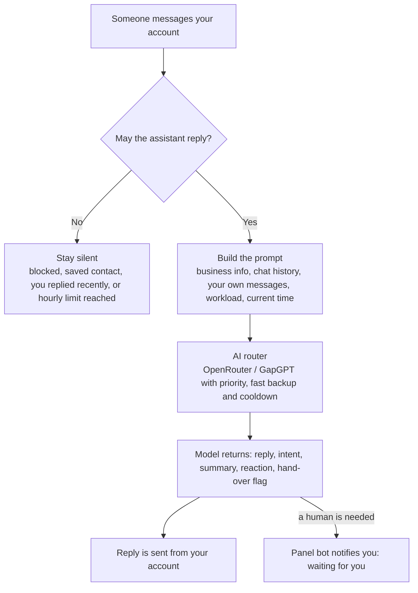

<div align="center">

# 🤖 Telegram DM Assistant

**An AI assistant that answers the private messages of your own Telegram account<br>while you are busy or offline — and hands the chat back the moment you step in.**


**English** · [فارسی](README.fa.md)

</div>

---

## Why this exists

If you sell a service through Telegram, every unanswered message is a client who may go to someone else.
You cannot be online all day — you are working on a project, asleep, or simply away.

This project puts an assistant **inside your own account**. People write to *you*, as they always did, and get a
useful answer in seconds — not a "we will get back to you" auto-reply, and not a separate support bot they have to find.

| Without it | With it |
|---|---|
| A message at 2 a.m. waits until morning | It is answered in seconds, in the client's own language |
| You come back to a 40-message thread | You read a 3-sentence summary and the client's intent |
| You repeat the same price and delivery answers all day | The assistant answers from the text you wrote once |
| You are afraid a bot will promise something wrong | It is built to give approximate ranges only — never a final price or date |
| A serious client is buried among casual chats | The chat is flagged **🔔 waiting for you** in your panel |

It is not meant to replace you. It keeps the conversation alive and collects the details, so that when you return
you close the deal instead of starting from "hi, how can I help?".

## Features

**Answering**
- Replies in private chats only, from your own account, in the language the person writes in
- Reads consecutive messages together and sends one coherent reply
- Remembers the last 50 messages per person, plus a running summary and intent
- Reacts to messages (👍 🙏 🔥 …) like a real person — only when it is at least 80% sure the reaction fits

**Staying safe for your business**
- Answers about services and prices **only** from the "About the business" text you write
- Prices are always approximate ranges; final price, discounts, contracts and payment are left to you
- Honest about what it is: it introduces itself as your assistant and never pretends to be you or a human
- Does not reveal which AI model is behind it, and stops replying to spam and meaningless messages

**Working with you, not instead of you**
- When you reply manually, the assistant goes quiet for that chat (2 hours by default)
- What you said yourself (a price, a date, a promise) becomes the reference it answers from
- Hands the chat over when a human is needed and notifies you in the panel
- Optional "workload" note: tell it you are busy until a date, and it explains that honestly when asked

**Reliable AI routing**
- Two OpenAI-compatible providers built in: **OpenRouter** and **GapGPT**
- Any number of models per provider, in your priority order
- Three strategies: priority with fast backup, race, or one by one
- Failed models are set aside for a while automatically; one-tap health check; 24-hour stats

**Admin panel inside Telegram**
- Everything is managed from a private panel bot with inline buttons — no config files to edit
- API keys and models are added from the panel, after deployment
- English and Persian interface (Gregorian or Jalali dates), any timezone

## How it works



Two Telegram connections run side by side in one process:

| Part | What it is | What it does |
|---|---|---|
| **Userbot** | Your own account, through Telegram's official API (Telethon) | Reads incoming private messages and sends the replies |
| **Panel bot** | A normal bot you create in @BotFather | Your private control panel; only you can use it |

## Quick start

### 1. What you need

| Item | Where to get it |
|---|---|
| Python 3.9 or newer | [python.org](https://www.python.org/downloads/) |
| `API_ID` and `API_HASH` | [my.telegram.org](https://my.telegram.org) → *API development tools* |
| A bot token for the panel | [@BotFather](https://t.me/BotFather) → `/newbot` (create a new bot just for this) |
| An AI API key | [OpenRouter](https://openrouter.ai/keys) or GapGPT — one of them is enough |

### 2. Install

```bash
git clone https://github.com/Parsa-dude/telegram-dm-assistant.git
cd telegram-dm-assistant
python3 -m venv venv
./venv/bin/pip install -r requirements.txt
```

### 3. First run

```bash
./venv/bin/python assistant_bot.py
```

The first run is interactive. It asks for the three required values and saves them to a local `.env` file:

```text
Telegram DM Assistant — راه‌اندازی اولیه | first-run setup
مقدارها در .env ذخیره می‌شوند | values are saved to .env

  API_ID    ← my.telegram.org : ********
  API_HASH  ← my.telegram.org : ********
  Bot token ← @BotFather : ********

✓ ذخیره شد | saved → .env
```

Telegram then asks for your phone number, the login code and (if enabled) your two-step password.
When this line appears in the log, it is working:

```text
Running as Sam (id=…) | panel: @your_bot → /start | admins: […]
```

### 4. Finish the setup in the panel

Open your panel bot in Telegram and send `/start`.

1. **Choose the language** — English or Persian.
2. **🧠 Models + keys** → pick a provider → **🔑 Set API key** and send the key.
   The message containing your key is deleted from the chat immediately.
3. **➕ Add model** → send the exact model ID from the provider's model list. It is tested on the spot.
4. **📋 About the business** → write what you offer, your price ranges and delivery times (example below).
5. Send a message to your account **from another account** to try it.

> [!NOTE]
> People saved in your contacts do not get automatic replies by default, so friends and family are left alone.
> You can change this in **⚙️ Settings → Reply to contacts**.

### 5. Keep it running

On a Linux server, use the included systemd unit:

```bash
sudo cp deploy/assistant-bot.service /etc/systemd/system/
sudo nano /etc/systemd/system/assistant-bot.service     # set your folder path
sudo systemctl daemon-reload
sudo systemctl enable --now assistant-bot
journalctl -u assistant-bot -f                          # live log
```

Run the bot once by hand first (step 3), so the login is already saved when the service starts.

## Example

**What you write in "📋 About the business":**

```text
I'm Sam, a freelance developer. I build Telegram bots and small web apps.

Services
- Shop bots (catalog, cart, payment link)
- Booking and appointment bots
- Channel auto-posting bots

Prices (approximate)
- Simple bot: $150–300
- Shop or booking bot: $300–700
- Larger custom projects: from $1,000

Delivery: usually 3–7 days, depending on the project.
Extras: 7-day free trial and one month of free support.
Samples: https://example.com/portfolio
```

**What a conversation can then look like** (illustrative — the wording comes from the model you choose):

> **Client:** Hi, how much is a shop bot?
>
> **Assistant:** Hi! I'm Sam's smart assistant 🙂 A shop bot is usually around $300–700, depending on the features. What will you be selling, and do you need online payment?
>
> **Client:** Clothes, with payment. Can you do it for exactly $300?
>
> **Assistant:** That's only an estimate — Sam gives the final price after seeing the details. I've passed your request on and Sam will get back to you soon.

**What you get in the panel at the same moment:**

```text
🔔 Alex is waiting for you
🎯 Wants a clothing shop bot with online payment; asks for a fixed price
📝 Asked about a shop bot, was given the $300–700 range, wants $300 confirmed.

[👤 Profile]  [✍️ Reply manually]
```

## The panel

```text
🎛 Sam's assistant panel

🟢 AI is on — the assistant replies

👥 Users: 42    🔔 Waiting for you: 3
📥 Messages today: 18    📤 Replies: 15

[🔴 Turn AI off (I'll reply myself)]
[👥 Users]            [🔔 Waiting (3)]
[🧠 Models + keys]    [📋 About the business]
[🗓 Workload]         [📝 Prompt]
[📊 Stats]            [⚙️ Settings]
[🩺 Health check]
[🔄 Refresh]          [🌐 زبان | Language]
```

| Section | What you do there |
|---|---|
| **AI on / off** | One tap to stop all automatic replies and answer everything yourself |
| **👥 Users** | Everyone who wrote to you: summary, intent, category, history. Per person: switch AI off, block, clear memory, or send a manual message from your account |
| **🔔 Waiting** | Chats the assistant handed over to you |
| **🧠 Models + keys** | API key per provider, model list and priority, provider order, strategy, timeout, cooldown |
| **📋 About the business** | The only source the assistant uses for services, prices and delivery times |
| **🗓 Workload** | A note about how busy you are, with an optional end date after which it switches off by itself |
| **📝 Prompt** | The assistant's behaviour and tone, if you want to rewrite the default |
| **⚙️ Settings** | Your name, timezone, reply to contacts, quiet time after your own reply, message batching, hourly limit per person, fallback text, language |
| **📊 Stats / 🩺 Health check** | Today's numbers, per-model success rate and speed, and a live test of every active model |

## How the assistant behaves

These rules are always sent to the model, whatever you put in the prompt:

- It greets and introduces itself once per conversation, then gets to the point.
- It uses only figures found in "About the business" or in your own messages, and presents them as estimates.
- If you already answered something yourself, it repeats *your* answer and never contradicts or extends it.
- Asked "are you a bot?", it says honestly, in one short sentence, that it is your assistant.
- Asked which AI model it is, it politely declines.
- It hands over to you for final prices, payment, contracts, complaints, collaboration requests and anything it cannot answer.
- It ignores ads and spam, and stops replying to someone who keeps sending meaningless messages.

Photos, voice messages and files are seen only as a placeholder such as `[photo]` — the assistant works with text.

> [!TIP]
> An AI model follows instructions closely, but not perfectly. Read the first few conversations in **👥 Users → History**
> and adjust your "About the business" text until the answers sound right.

## Configuration

Only three values are required, and the first run asks for them. Everything else is set from the panel.

| Variable | Required | Meaning |
|---|:---:|---|
| `TG_API_ID` | ✅ | Telegram API ID |
| `TG_API_HASH` | ✅ | Telegram API hash |
| `PANEL_BOT_TOKEN` | ✅ | Token of the panel bot |
| `EXTRA_ADMIN_IDS` | | Extra panel admins (numeric IDs, comma-separated). The account owner is always an admin |
| `TG_SESSION` | | Session file name (default `assistant_session`) |
| `DB_PATH` / `LOG_PATH` | | Database and log file (default `assistant.db`, `assistant.log`) |
| `GAPGPT_KEY` / `OPENROUTER_KEY` | | API keys, if you prefer `.env` over the panel (the panel value wins) |

See [`.env.example`](.env.example).

## Security and privacy

- **The `.session` file is full access to your Telegram account.** Never share or upload it.
- `.env`, the session and the database are created readable by the owner only, and all of them are in `.gitignore`.
- API keys entered in the panel are stored in the local SQLite database on your own server.
- Conversations are stored locally. To generate a reply, the relevant part of a conversation is sent to the AI provider you configured — check that provider's data policy if this matters for your work.
- Only the account owner (and the IDs in `EXTRA_ADMIN_IDS`) can use the panel.
- The assistant never starts a conversation; it only answers people who wrote to you first. Use it within Telegram's Terms of Service.

## Troubleshooting

| Symptom | Cause and fix |
|---|---|
| No reply while testing | You are writing from a saved contact, or you replied manually within the quiet time, or no key/model is set. The log shows the reason: `skip uid=… reason=…` |
| Panel shows "Setup incomplete" | Add an API key and at least one model in **🧠 Models + keys** |
| Model test shows `401` | The API key is wrong or expired |
| Model test shows `model not found` | The model ID is wrong — copy it exactly from the provider's list |
| `409 Conflict` in the log | The panel bot token is being used by another program. Create a separate bot for the panel |
| Service exits with "not configured" | Run the bot once by hand so it can ask for the required values |
| The panel does not answer | Send `/start` to the panel bot from the account that is logged in |

## Project layout

```text
assistant_bot.py              the whole application, in one file
requirements.txt              telethon + aiohttp
.env.example                  the variables you can set
deploy/assistant-bot.service  systemd unit for 24/7 running
tests/test_offline.py         offline checks (no network, no real account)
```

Built with Python, [Telethon](https://github.com/LonamiWebs/Telethon) for the account connection, the raw Telegram Bot API
over aiohttp for the panel, and SQLite for storage. No other services are needed.

```bash
python tests/test_offline.py     # takes about a second
```

## License

[MIT](LICENSE) — free to use, change and build on.

## Author

**Parsa Rahmani** — Python developer; Telegram bots, automation and AI integration.
[parsa-projects.ir](https://parsa-projects.ir) · [GitHub](https://github.com/Parsa-dude)

If this project is useful to you, a ⭐ helps other people find it.
